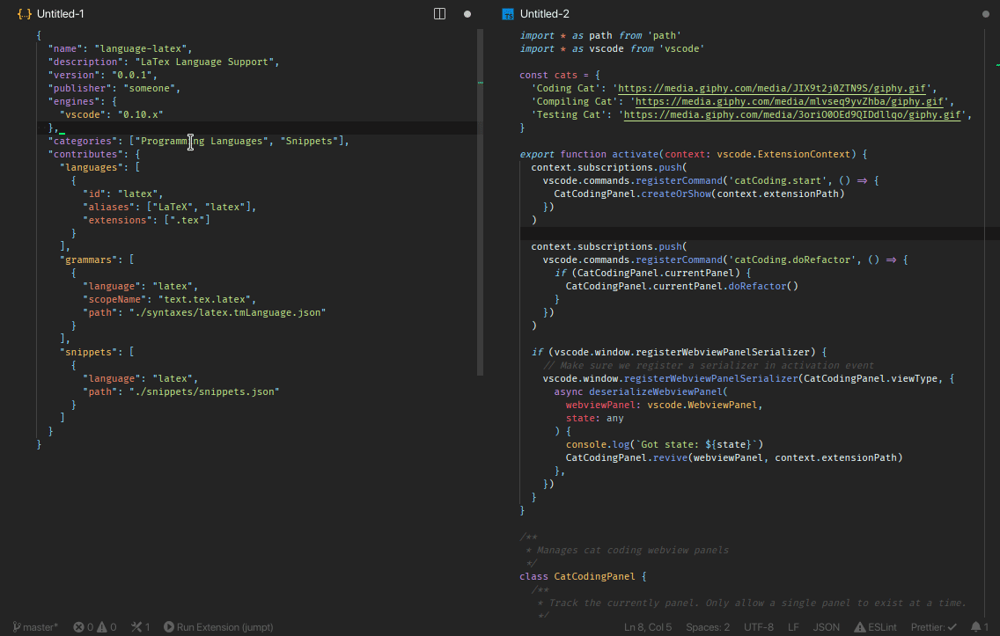

# JumpᏆ

Simple vscode extension for fast navigation.

## Features
- Support multi-columns layout
- Jump back command
- Auto-scroll



## Usage
- Activate jumpt input (configure shortcut or find in command palette)
- Enter target sub-string
- Use one of configured triggering methods:
  - Enter separator sign, then target anchor sign
  - Enter target anchor sign after search query with static length


## Commands
- extension.jumpt - activate jump input  
  ```json
  {
    "key": "...",
    "command": "extension.jumpt"
  },
  {
    "key": "...",
    "command": "extension.jumpt",
    "args": { "select": true }
  },
  {
    "key": "...",
    "command": "extension.jumpt",
    "args": { "caseSensitive": true }
  },
  ```
- extension.jumptback - jump back  
  ```json
  {
    "key": "...",
    "command": "extension.jumptback"
  },
  ```


## Settings
__Anchors__  
Available anchor signs.  
`jumpt.anchors: string`  
`default: "fjdksla;vmbcghieorwnp/FJALKMVCER"`

__Trigger__  
Separator char between a search query and target anchor or static length of the search query followed by target anchor.  
`jumpt.trigger: string | number`  
`default: " "`

__Auto-scroll__  
Auto-scroll to new position.  
`jumpt.scroll: boolean`  
`default: false`

__Anchor mode__  
Anchor mode.  
`jumpt.anchorMode: AnchorMode`  
`- "default" - Replaces the first char with anchor and highlights matched text`  
`- "fullWidth" - Replaces the matched text with an anchor surrounded by placeholder chars`  
`default: "default"`

__Anchor placeholder char__  
Placeholder char for 'fullWidth' anchor mode.  
`jumpt.anchorPlaceholderChar: string`  
`default: "_"`

__Background color of anchor__  
Anchor background color.  
`jumpt.anchorBg: string`  
`default: "#0C82F7"`

__Foreground color of anchor__  
Anchor foreground color.  
`jumpt.anchorFg: string`  
`default: "#ffffff"`

__Background color of matched text__  
Anchor background color.  
`jumpt.queryBg: string`  
`default: "#0C82F7"`

__Foreground color of matched text__  
Anchor foreground color.  
`jumpt.queryFg: string`  
`default: "#ffffff"`


## Alternatives
- Find-Jump
- Find-Then-Jump
- Xray-Jump
- Jumpy
- Code Ace Jumper


## Licence
MIT